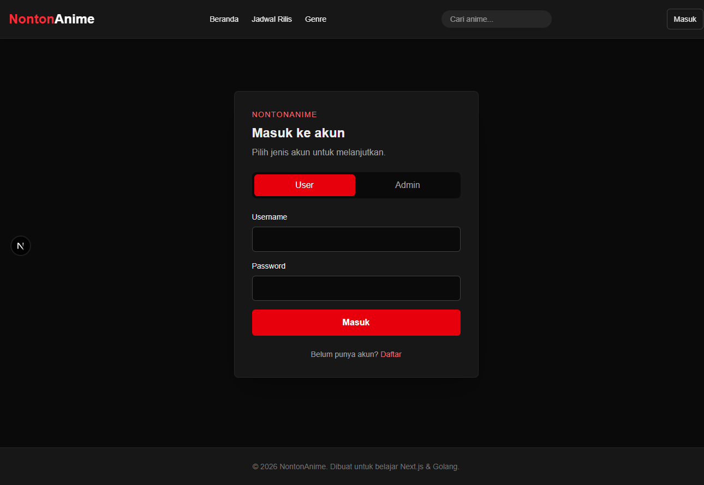
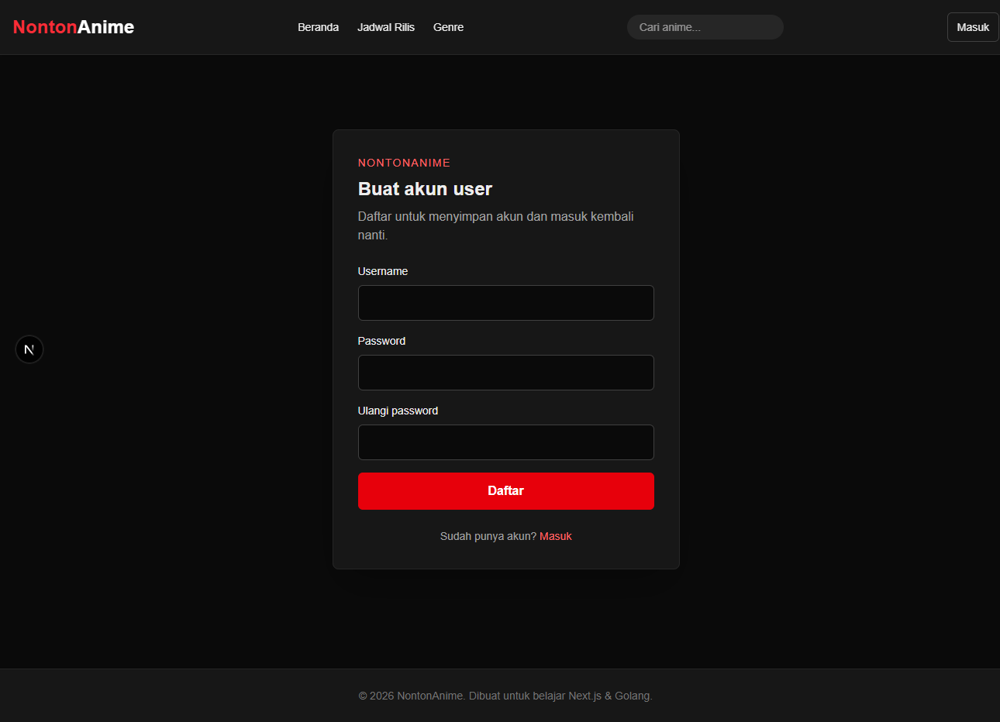
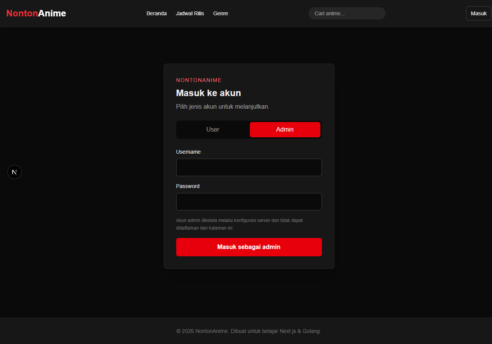
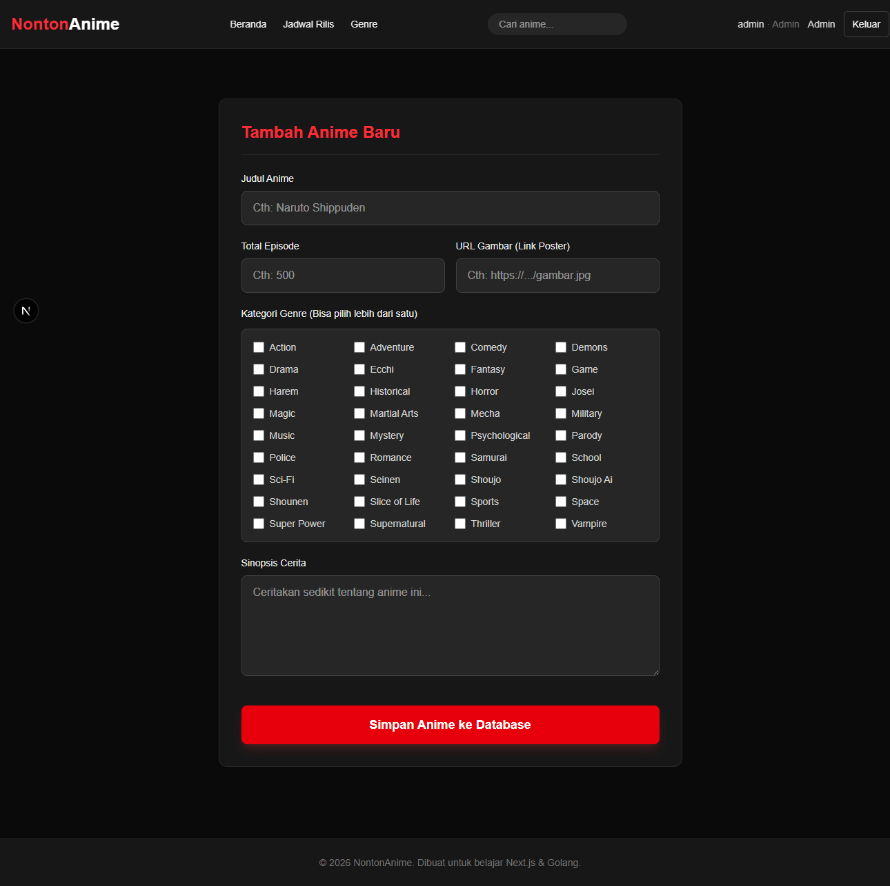
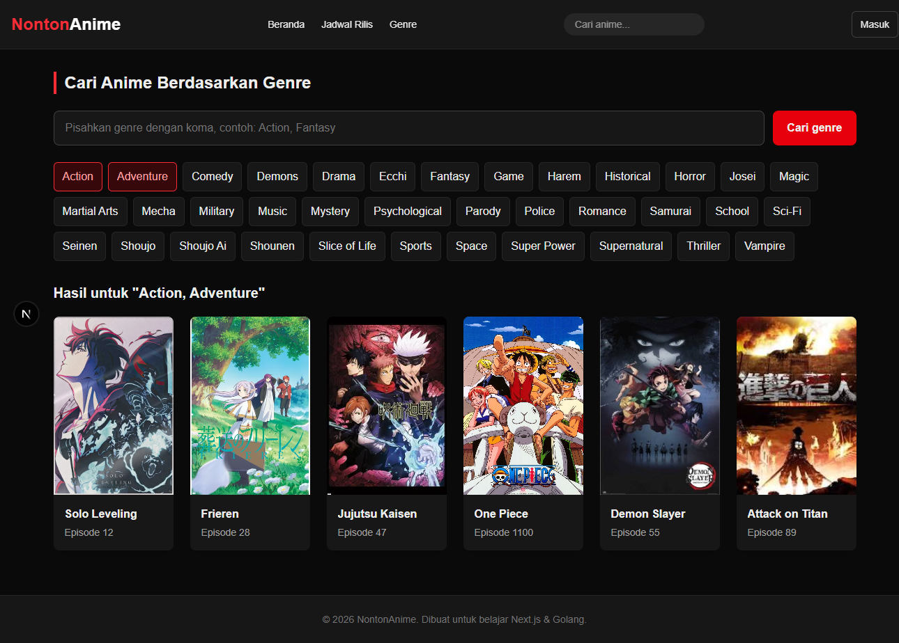

# NontonAnime

Aplikasi katalog anime dengan pencarian judul, filter beberapa genre, akun user, dan halaman pengelolaan admin.

## Screenshot Alur

### Login user



### Daftar user



### Login admin



### Dashboard admin



### Pencarian beberapa genre



## Fitur

- Katalog anime dengan poster dan detail.
- Pencarian judul dan filter genre, termasuk memilih beberapa genre sekaligus.
- Pendaftaran serta login user.
- Login admin terpisah dan pembatasan halaman admin.
- Password disimpan menggunakan hash bcrypt; sesi memakai cookie `HttpOnly`.

## Menjalankan Lokal

Persyaratan: Node.js, npm, dan Go versi yang tercantum di `backend-anime/go.mod`.

Jalankan frontend di terminal pertama:

```powershell
npm install
npm run dev
```

Jalankan backend di terminal kedua. Admin dibuat atau diperbarui saat backend mulai; pilih password pribadi minimal 12 karakter dan jangan commit nilainya.

```powershell
$env:ADMIN_USERNAME = "admin"
$env:ADMIN_PASSWORD = "<password-pribadi-minimal-12-karakter>"
$env:WEB_ORIGIN = "http://localhost:3000"
Set-Location .\backend-anime
go run .
```

Buka `http://localhost:3000`. User dapat membuat akun di `/register`; halaman masuk berada di `/login`. Untuk HTTPS, set `COOKIE_SECURE=true`. Jika frontend memakai origin lain, sesuaikan `WEB_ORIGIN`, lalu restart backend.

Database `backend-anime/anime.db` dibuat lokal dan tidak boleh dimasukkan ke commit karena berisi akun serta hash password.

## GitHub

Repository ini publik. GitHub tidak menerbitkan Release atau ZIP aplikasi, tetapi source pada repository publik tetap dapat di-clone atau diunduh sebagai arsip source. GitHub Pages tidak menjalankan backend Go; aplikasi penuh memerlukan frontend Next.js dan API Go yang berjalan.